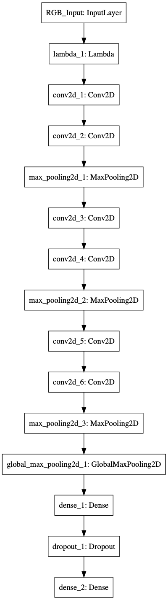
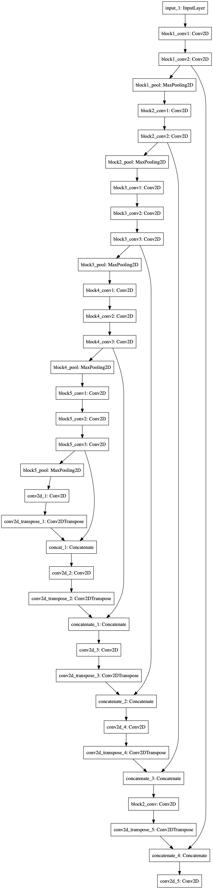

# Ship Detection in Satelite Images
In this repo I present my solution for the [Airbus Ship Detection challenge](https://www.kaggle.com/c/airbus-ship-detection) on Kaggle.
There was a data leakage in this competition which allowed for almost perfect scores. However, I personally used this comptetion as an introduction to computer vision and learned a lot about neural networks. 

## Approach
I developed two models. The fist is a quite simple image classification model which predicts if there is a boat within the image or not. The second is a sematic segmentation model which divides the image into background and foreground (=ships). Both neural networks are based on the Tensorflow wrapper Keras. In a third step the pictures which contain no boat are determined using the classification model and written to a dataframe. For the images that do contain a boat the instance segmentation model is run. Then the predicted masks gets encoded and are added to the dataframe. This dataframe contains the predictions for the entire test dataset. 

## Image classification model
For the image classification model I have trained a simple Convolution Neural Network (CNN). It takes an input of 512 x 512 x 3 image and generates an output of (None, 1). 

This is the visualization of the network:

It consists of three convolution blocks. Each block contains two Convolution layers and one Max Pooling layer. The top of the network consists of one Global Max Pooling layer, a Dense and Dropout layer. During the running I managed to get an accurarcy of up to 89% with this fairly simple setup. 

## Instance Segementation Model
The instance segmentation model was inspired by [TernausNet](https://arxiv.org/abs/1801.05746). An implementation of the U-net architecture can be found [here](https://github.com/ternaus/TernausNet). The architecture of the U-net looks like this: 

In the paper the authors argue that a U-net architecture can be improved with a pre-trained encoder. The authors propose a VGG-11 encoder and that networks with a pre-trained encoder converge faster than networks without. However, since Keras offers a VGG16 pre-trained on the ImageNet dataset, I decided to use this encoder. The final architecture looks like this:

