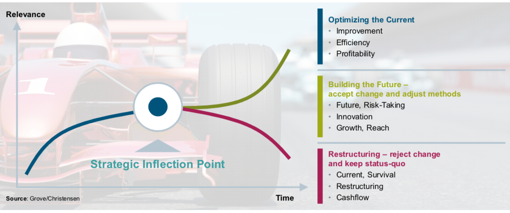

# Ship Detection in Satelite Images
In this repo I present my solution for the Airbus Ship Detection challenge on Kaggle https://www.kaggle.com/c/airbus-ship-detection

## Approach
Basically, I developed two models. The fist is a quite simple image classification model which predicts if there is a boat within the image or not. The second is a sematic segmentation model which divides the image into background and foreground (=ships). Both neural networks use the Keras library

## Image classification model
For the image classification model I have trained a simple Convolution Neural Network (CNN). It takes an input of 512 x 512 x 3 image and generates an output of (None, 1). 

A visualization of the network can be found here: 

*Put tensorflow graph generation*

